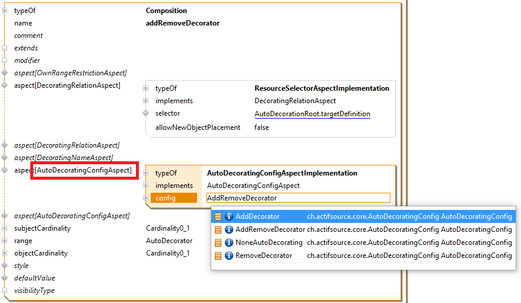
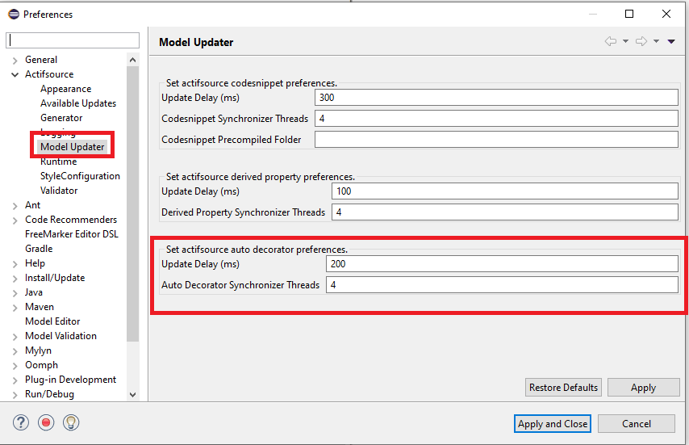

# Auto Decoration
In this project we will show how to define auto decoration.

## Auto Decoration
The auto decorating configuration options are:
- NoneAutoDecorating: Auto decorating is disabled.
- AddDecorator: Add missing decorators.
- RemoveDecorator: Remove decorators if the target not exist.
- AddRemoveDecorator: Add missing decorators and remove decorators if the target not exist.

## Auto Decoration Preferences

## Requirements
Actifsource Workbench Community Edition

## License
[http://www.actifsource.com/company/license](http://www.actifsource.com/company/license)
